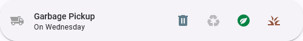

# Peel Garbage Schedule — Home Assistant Integration

This repository contains a Home Assistant custom integration that provides Peel Region garbage collection schedules as sensors and binary-sensors. 



## What you'll need

- Home Assistant (core) with this custom integration installed under `custom_components/peel_garbage_collection`
- Lovelace custom cards used in the example:
	- Mushroom (custom card package) — provides `mushroom-template-card`. See https://github.com/mudassarjahan/mushroom
	- stack-in-card (custom:stack-in-card) — for horizontal stacking. See https://github.com/custom-cards/stack-in-card
	- paper-buttons-row (custom:paper-buttons-row) — compact row of icon buttons. See https://github.com/iantrich/paper-buttons-row

Install these custom cards using HACS or by placing them into your `www` folder and adding resources in the Lovelace dashboard configuration.

## Example Lovelace card

Below is a ready-to-use Lovelace YAML snippet. It uses sensors that the integration provides — names shown are examples and should match the entities created in your Home Assistant instance.

Replace entity IDs with the ones from your installation (you can find them under Settings → Devices & Services → Entities).

```yaml
- type: grid
  cards:
    - type: custom:stack-in-card
      mode: horizontal
      cards:
        - type: custom:mushroom-template-card
          primary: Garbage Pickup
          secondary: >-
            
            
              On {{ as_timestamp(date) | timestamp_custom('%A') }}
            
              No upcoming collection date
            
          icon: mdi:dump-truck
          fill_container: true
        - type: entities
          entities:
            - type: custom:paper-buttons-row
              base_config:
                type: entity
                layout: icon
                tap_action:
                  action: none
                hold_action:
                  action: none
                state_styles:
                  'off':
                    icon:
                      color: >-
                        color-mix(in srgb, var(--state-icon-color) 40%, transparent)
              buttons:
                - entity: binary_sensor.next_collection_garbage
                  tooltip: Garbage Collection
                  state_styles:
                    'on':
                      icon:
                        color: '#607D8B'
                - entity: binary_sensor.next_collection_recycling
                  tooltip: Recycling Collection
                  state_styles:
                    'on':
                      icon:
                        color: '#0071b1'
                - entity: binary_sensor.next_collection_organics
                  tooltip: Organics Collection
                  state_styles:
                    'on':
                      icon:
                        color: '#048242'
                - entity: binary_sensor.next_collection_yard_waste
                  tooltip: Yard Waste Collection
                  state_styles:
                    'on':
                      icon:
                        color: '#94543c'
```

## Contributing

See `CONTRIBUTING.md` for details on how to contribute.

## License

This project is licensed under the terms in the `LICENSE` file.


## Install via HACS (recommended)

You can install this integration and the required frontend cards using HACS (Home Assistant Community Store). Installing via HACS makes updates easier and avoids manual copying of files.

1. Install HACS if you haven't already: https://hacs.xyz/docs/installation/prerequisites

2. Add this repository as a custom repository in HACS:

  - Open Home Assistant web UI.
  - Go to **HACS → Integrations** (or **HACS → Frontend** if adding a frontend card).
  - Click the three-dot menu (top right) and choose **Custom repositories**.
  - In the dialog add these values:
    - Repository: `tanmayparikh/peel-garbage-schedule-ha`
    - Category: `Integration`
  - Click **Add**.

3. Install the integration:

  - In HACS, go to **Integrations**, find **Peel Garbage Schedule** (or search for "peel"), and click **Install**.
  - After installation, restart Home Assistant (required for integration integration to be loaded).

Notes:
- When adding the custom repository for this integration, choose category `Integration` (not `Frontend`). The frontend cards mentioned above should be installed separately under `Frontend` in HACS.
- If you prefer not to use HACS, you can install the integration by copying this repository's `custom_components/peel_garbage_collection` folder into your Home Assistant `custom_components/` directory and installing frontend cards manually into `www`.

